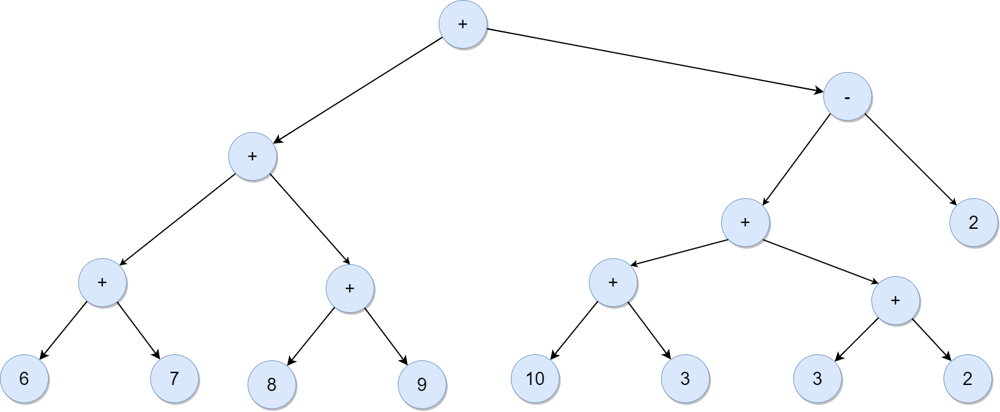

# 1er Expresión
###### 3 + 6 + 6 + 2 * 3 + 2 * 5

#### Preorden
```java
3 + 6 + 6 + (* 3 2) + (* 2 5)
(+ 3 6) + (+ 6 (* 3 2)) + (* 2 5)
(+ (+ 3 6)(+ 6 (* 3 2)) + (* 2 5))
```
**+ + + 3 6 + 6 * 3 2 * 2 5**


|   |   |   |   |   |   |   |   |   |   |   |   |
|---|---|---|---|---|---|---|---|---|---|---|---|
|    |   |  2 |   |    |   |    |   |    |   |    |   |
|    |   |  3 |   |    |   |    |   |    |   |    |   |
|    |   |  * |   |   6|   |    |   |    |   |    |   |
| 6  |   | 6  |   |  6 |   |    |   | 5  |   |    |   |
| 3  |   | +  |   |  + |   | 12 |   | 2  |   |    |   |
| +  |   | 9  |   |  9 |   | 9  |   |  * |   | 10 |   |
| +  |   | +  |   | +  |   | +  |   | 21 |   | 21 |   |
| +  |   |  + |   | +  |   | +  |   | +  |   | +  | 31|


#### Postorden
```java
3 + 6 + 6 + (2 3 *) + (2 5 *)
(3 6 +) + 6 + (2 3 *) + (2 5 *)
((3 6 +) 6 +) + (2 3 *) + (2 5 *)
(((3 6 +) 6 +)(2 3 *) +) + (2 5 *)
```
**3 6 + 6 + 2 3 * + 2 5 * +**

|   |   |   |   | *  |   |    |   | *  |   |    |   |    |
|---|---|---|---|----|---|----|---|----|---|----|---|----|
| + |   | + |   | 3  |   | +  |   | 5  |   | +  |   |    |
| 6 |   | 6 |   | 2  |   | 6  |   | 2  |   | 10 |   |    |
| 3 |   | 9 |   | 15 |   | 15 |   | 21 |   | 21 |   | 31 |


# 2da Expresión
###### 6 + 7 + 8 + 9 + 10 * 3 + 3 + 2 - 2


#### Preorden
**+ + + 6 7 + 8 9 - + * 10 3 + 3 2 2**

|   |   |    |   |    |   |    |   |    |   |    |   |    |   |    |   |    |
|---|---|----|---|----|---|----|---|----|---|----|---|----|---|----|---|----|
|   |   |    |   |    |   |    |   | 2  |   |    |   |    |   |    |   |    |
|   |   |    |   |    |   | 3  |   | 3  |   |    |   |    |   |    |   |    |
|   |   | 9  |   |    |   | 10 |   | +  |   | 5  |   |    |   |    |   |    |
| 7 |   | 8  |   |    |   | *  |   | 30 |   | 30 |   | 2  |   |    |   |    |
| 6 |   | +  |   | 17 |   | +  |   | +  |   | +  |   | 35 |   |    |   |    |
| + |   | 13 |   | 13 |   | -  |   | -  |   | -  |   | -  |   | 33 |   |    |
| + |   | +  |   | +  |   | 30 |   | 30 |   | 30 |   | 30 |   | 30 |   |    |
| + |   | +  |   | +  |   | +  |   | +  |   | +  |   | +  |   | +  |   | 63 |


#### Postorden
**6 7 + 8 9 + + 10 3 * 3 2 + + 2 - +**

|   |   |    |   |    |   |    |   |    |   |    |   |    |   |    |   |    |
|---|---|----|---|----|---|----|---|----|---|----|---|----|---|----|---|----|
|   |   |    |   |    |   |    |   | +  |   |    |   |    |   |    |   |    |
|   |   | +  |   |    |   | *  |   | 2  |   | +  |   | -  |   |    |   |    |
| + |   | 9  |   | +  |   | 3  |   | 3  |   | 5  |   | 2  |   | +  |   |    |
| 7 |   | 8  |   | 17 |   | 10 |   | 30 |   | 30 |   | 35 |   | 33 |   |    |
| 6 |   | 13 |   | 13 |   | 30 |   | 30 |   | 30 |   | 30 |   | 30 |   | 63 |


